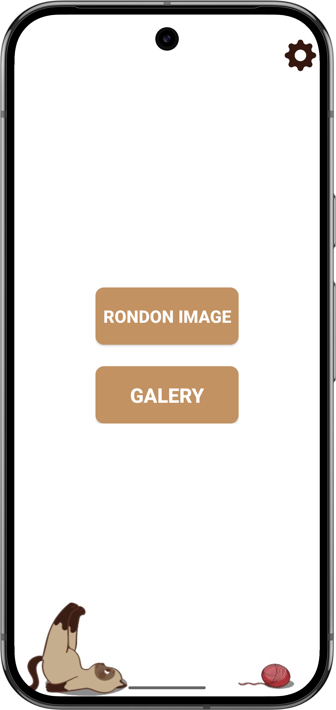
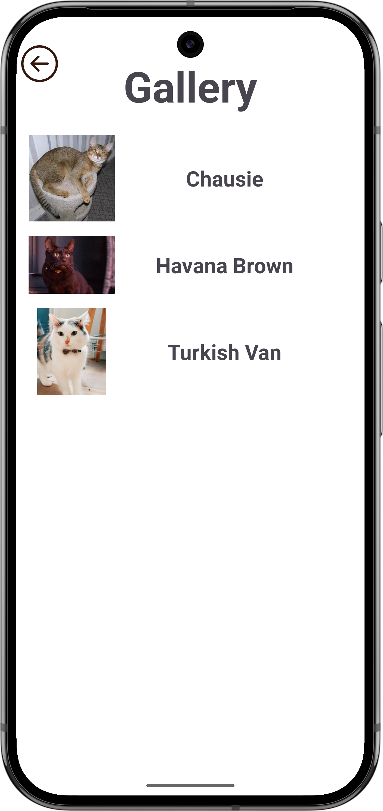
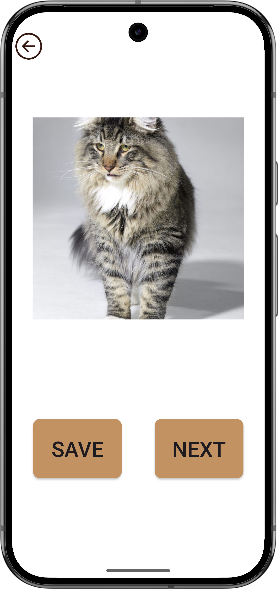

# 🐾 This Cat

Aplicativo Android desenvolvido como trabalho final da disciplina de Dispositivos Móveis. O objetivo do app é exibir gatos aleatórios para que o usuário possa salvar seus favoritos, explorando conceitos modernos de desenvolvimento mobile.

---

## ✨ Funcionalidades

- **🎲 Gatos Aleatórios:** Veja fotos de gatos diferentes a cada clique, consumindo a [TheCatAPI](https://thecatapi.com/).
- **⭐ Favoritar Gatinhos:** Salve seus felinos favoritos com apenas um toque.
- **📋 Lista de Favoritos:** Acesse facilmente todos os gatos que você favoritou.
- **🔄 Atualização Instantânea:** Novas imagens sempre que quiser, direto da TheCatAPI.
- **🐱 Informações de Raça:** O app exibe o nome e descrição da raça dos gatos, quando disponível.
- **🗑️ Exclusão Segura:** Confirmação antes de excluir gatos favoritos, evitando remoções acidentais.
- **🔑 Configuração de API Key:** Permite ao usuário definir sua chave da API para acesso completo às funcionalidades.

---

## 🛠️ Tecnologias e Bibliotecas Utilizadas

- **Kotlin:** Linguagem principal do projeto.
- **Retrofit:** Consumo de APIs REST de forma simples e eficiente.
- **Room (com TypeConverters):** Persistência local dos favoritos, agora com suporte a listas de raças.
- **RecyclerView:** Exibição dinâmica e performática de listas.
- **ConstraintLayout:** Layouts flexíveis e modernos para a UI.
- **Koin:** Injeção de dependências para facilitar manutenção e testes.
- **Glide:** Carregamento eficiente de imagens.

---

## 🚀 Instalação

1. Baixe o APK disponível nas [releases do GitHub](https://github.com/gRhuan/Trabalho-final-android/releases).
2. Instale diretamente em seu dispositivo Android.
3. Permita a instalação de fontes desconhecidas caso solicitado.
4. Abra o app e aproveite a chuva de fofura felina! 🐱

---

## 🔑 Configuração da API

Para salvar gatos favoritos, é necessário obter uma chave da [TheCatAPI](https://thecatapi.com/).  
No app, acesse o menu de configurações e insira sua chave para liberar todas as funcionalidades.

---

## 📸 Screenshots

> 
> 
> 

---

## 📝 Release Notes (v1.0.0)

- Exibição de informações de raça dos gatos.
- Confirmação de exclusão de favoritos.
- Melhor tratamento de dados e suporte completo às informações da API.
- Atualização do banco de dados para v2, com TypeConverters.
- Refatoração do código e melhorias de UX.
- Correções de bugs e melhorias de navegação.

[Veja o changelog completo](https://github.com/gRhuan/Trabalho-final-android/releases)

---

## 🤝 Contribuição

Contribuições são bem-vindas! Sinta-se à vontade para abrir issues ou pull requests.

---

## 📄 Licença

Este projeto é apenas para fins educacionais.

---

**Desenvolvido por Gladyson Rhuan para a disciplina de Dispositivos Móveis.**
